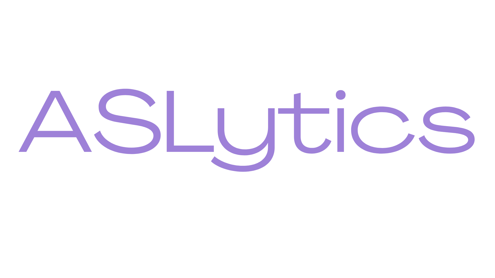
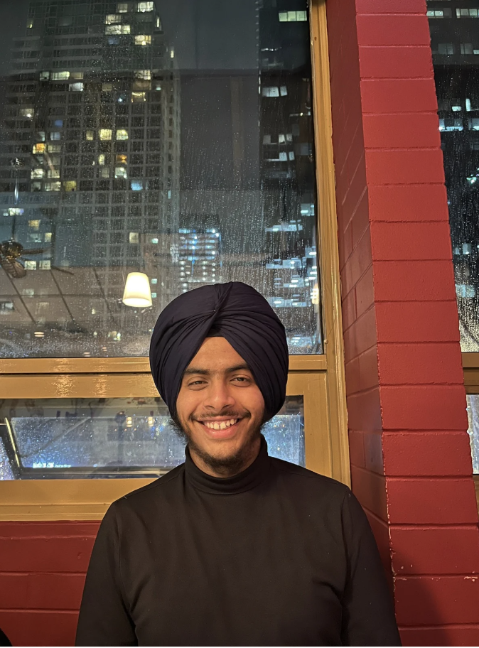
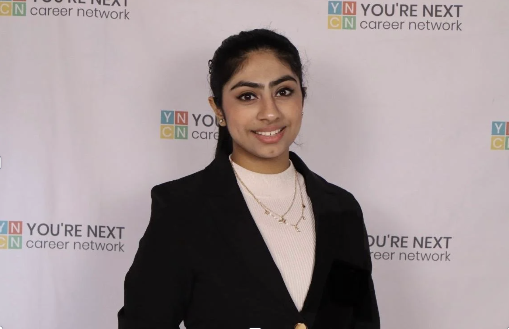
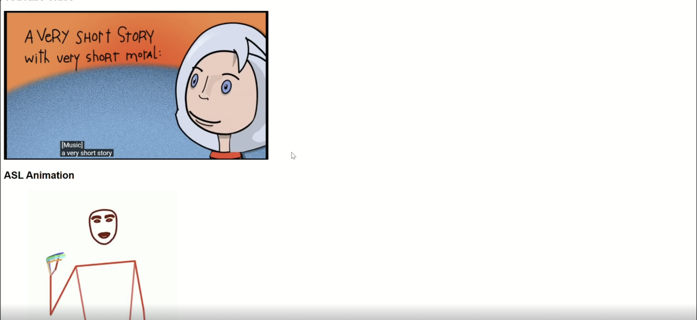

<p align="center">
  
</p>

<h1 align="center">ASLytics: Bridging the Knowledge Gap for the Deaf and Hard-of-Hearing Community</h1>

**Team Members:**

- Mankanwar
- Japleen Kaur

---

## **Introduction**

### **Main Theme & Problem**

ASLytics addresses the inaccessibility of online video content for Deaf and hard-of-hearing individuals, particularly on platforms like YouTube where sign language support is scarce. Traditional subtitles often fall short, with studies showing 84% of Deaf children struggle to keep up with caption speed (National Deaf Children's Society, 2021). As ASL is the primary language for many in the Deaf community (Mitchell & Karchmer, 2004), digital content often fails to meet their needs, creating a significant gap in access to information and entertainment.

### **What We Aim to Do**

ASLytics is a full-stack AI-powered YouTube extension that transforms English captions into real-time ASL animations, providing the Deaf and hard-of-hearing community with equitable access to learning, information, and entertainment.

---

## **Team Members**

|  |  |
| :--------------------------------: | :----------------------------: |
|          Mankanwar Singh           |          Japleen Kaur          |

---

## **Acknowledgements**

### **Gloss-to-Pose-to-Video Repository**

We gratefully acknowledge the **Sign Language Processing** open-source toolkit used for gloss-to-pose and pose-to-video conversion. Please consider citing the repository if you use this toolkit in your work:

```bibtex
@misc{moryossef2021pose-format,
    title={pose-format: Library for viewing, augmenting, and handling .pose files},
    author={Moryossef, Amit and M\"{u}ller, Mathias and Fahrni, Rebecka},
    howpublished={\url{https://github.com/sign-language-processing/pose}},
    year={2021}
}
```

---

## **Results**

Here is an example of ASLytics in action, demonstrating real-time ASL animations synchronized with YouTube captions:



---

## **How to Use**

### Prerequisites

- **conda** — the gloss and pose steps need incompatible versions of torch and
  numpy, so they live in separate environments.
- **ffmpeg** — `apt install ffmpeg` or `brew install ffmpeg`.

### 1. Install

```bash
bash install.sh
```

Creates `text-to-gloss` (English → gloss) and `gloss-to-skeleton`
(gloss → pose → video), downloads the StanfordNLP English models, and installs
the Flask layer into your current environment.

### 2. Supply the sign lexicon

**The pipeline cannot run without this, and the files are not in this
repository.** `gloss_to_pose()` needs one `.pose` file per gloss, named
`<gloss>.pose`.

Put them in `lexicon/`, or point at them:

```bash
export ASLYTICS_LEXICON_DIR=/path/to/your/pose/files
```

To generate them from sign videos, use `pose-format`'s estimator — and read
`DATA_LICENSES.md` first, because which corpus the videos come from determines
whether the result can be used commercially:

```bash
videos_to_poses --format mediapipe --directory /path/to/sign/videos
```

> If you have an existing checkout, the lexicon may be in a directory named
> `.gitignore/generated_pose`. That still works, but the name collides with the
> gitignore *file* a repository normally has at its root, so move it to
> `lexicon/` when convenient.

### 3. Run

```bash
bash old_main.sh                        # smoke test: renders one fixed sentence
python app.py                           # then open http://127.0.0.1:5000
```

Or use the Chrome extension: run `python server.py`, then load `extension/`
unpacked via `chrome://extensions` → Developer mode → Load unpacked.

### Configuration

| Variable | Default | What it does |
|---|---|---|
| `ASLYTICS_LEXICON_DIR` | `lexicon/` | Where the per-gloss `.pose` files live |
| `ASLYTICS_WORK_DIR` | `.work/` | Scratch space for intermediate poses and video |
| `ASLYTICS_VIDEO_DIR` | `videos/` | Rendered clips |
| `ASLYTICS_GLOSS_ENV` | `text-to-gloss` | conda env for the gloss step |
| `ASLYTICS_POSE_ENV` | `gloss-to-skeleton` | conda env for the pose step |

### Licensing

`DATA_LICENSES.md` audits every dataset and pretrained model this project
touches. Read it before any commercial use: one dataset behind the
`pose-to-video` renderer models is non-commercial, the sign lexicon's
provenance is unrecorded, and `text-to-gloss/start.py` is GPL-3.0.
