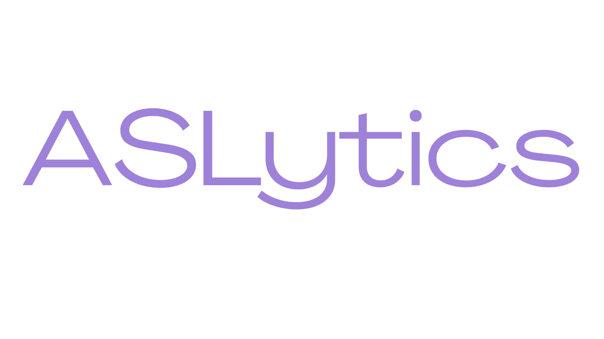
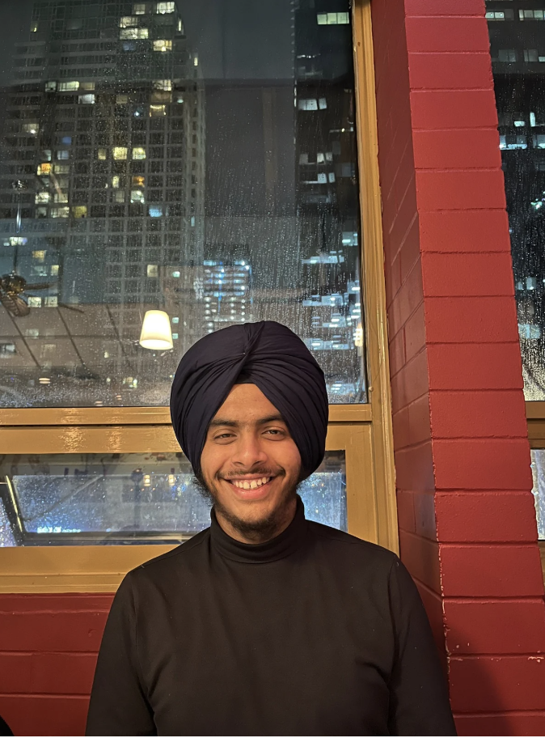
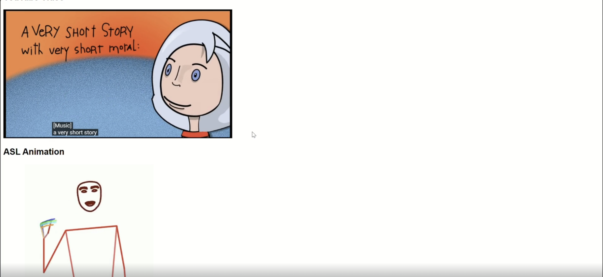

<p align="center">
  
</p>

<h1 align="center">ASLytics: Bridging the Knowledge Gap for the Deaf and Hard-of-Hearing Community</h1>

**Team Members:**

- Mankanwar
- Japleen Kaur

---

## **Introduction**

### **Main Theme & Problem**

ASLytics addresses the inaccessibility of online video content for Deaf and hard-of-hearing individuals, particularly on platforms like YouTube where sign language support is scarce. Traditional subtitles often fall short, with studies showing 84% of Deaf children struggle to keep up with caption speed (National Deaf Children's Society, 2021). As ASL is the primary language for many in the Deaf community (Mitchell & Karchmer, 2004), digital content often fails to meet their needs, creating a significant gap in access to information and entertainment.

### **What We Aim to Do**

ASLytics is a full-stack AI-powered YouTube extension that transforms English captions into real-time ASL animations, providing the Deaf and hard-of-hearing community with equitable access to learning, information, and entertainment.

---

## **Team Members**

|  |  |
| :--------------------------------: | :----------------------------: |
|          Mankanwar Singh           |          Japleen Kaur          |

---

## **Acknowledgements**

### **Gloss-to-Pose-to-Video Repository**

We gratefully acknowledge the **Sign Language Processing** open-source toolkit used for gloss-to-pose and pose-to-video conversion. Please consider citing the repository if you use this toolkit in your work:

```bibtex
@misc{moryossef2021pose-format,
    title={pose-format: Library for viewing, augmenting, and handling .pose files},
    author={Moryossef, Amit and M\"{u}ller, Mathias and Fahrni, Rebecka},
    howpublished={\url{https://github.com/sign-language-processing/pose}},
    year={2021}
}
```

---

## **Results**

Here is an example of ASLytics in action, demonstrating real-time ASL animations synchronized with YouTube captions:



---

## **How to Use**

### Prerequisites

- **Python 3.10+.** conda is optional.
- **ffmpeg** is optional: if none is on PATH, the copy bundled with
  `imageio-ffmpeg` (installed below) is used.

### 1. Install

```bash
bash install.sh             # creates .venv in the repo — works on Linux, macOS, Windows (Git Bash)
bash install.sh --conda     # or: separate conda environments per pipeline half
```

Installs everything into one virtualenv and downloads the StanfordNLP English
models.

**Without bash** (e.g. PowerShell on Windows):

```powershell
python -m venv .venv
.venv\Scripts\python -m pip install -r requirements.txt -r text-to-gloss/requirements.txt -r requirements-render.txt
.venv\Scripts\python -c "import stanfordnlp; stanfordnlp.download('en', force=True)"
```

### 2. Supply the sign lexicon

**The pipeline cannot run without this, and the files are not in this
repository.** `gloss_to_pose()` needs one `.pose` file per gloss, named
`<gloss>.pose`.

Put them in `lexicon/`, or point at them:

```bash
export ASLYTICS_LEXICON_DIR=/path/to/your/pose/files
```

To generate them from sign videos, use `pose-format`'s estimator — and read
`DATA_LICENSES.md` first, because which corpus the videos come from determines
whether the result can be used commercially:

```bash
videos_to_poses --format mediapipe --directory /path/to/sign/videos
```

> If you have an existing checkout, the lexicon may be in a directory named
> `.gitignore/generated_pose`. That still works, but the name collides with the
> gitignore *file* a repository normally has at its root, so move it to
> `lexicon/` when convenient.

### 3. Run

```bash
python utils/aslytics_env.py            # check the setup; lists everything missing at once
python utils/generate_asl_video.py "the cat is small" test.mp4   # one sentence end to end
python app.py                           # then open http://127.0.0.1:5000
```

`python utils/generate_asl_video.py --glosses "come bake" test.mp4` skips the
English-to-gloss step, which is the quickest way to test rendering alone.
`bash old_main.sh` and `bash main.sh` still work; they call the same Python.

Or use the Chrome extension: run `python server.py`, then load `extension/`
unpacked via `chrome://extensions` → Developer mode → Load unpacked.

### Configuration

| Variable | Default | What it does |
|---|---|---|
| `ASLYTICS_LEXICON_DIR` | `lexicon/` | Where the per-gloss `.pose` files live |
| `ASLYTICS_WORK_DIR` | `.work/` | Scratch space for intermediate poses and video |
| `ASLYTICS_VIDEO_DIR` | `videos/` | Rendered clips |
| `ASLYTICS_RUNNER` | `auto` | `auto` uses conda if its environments exist, else Python; or force `conda` / `python` |
| `ASLYTICS_PYTHON` | repo `.venv`, else the current Python | Interpreter for both pipeline halves |
| `ASLYTICS_GLOSS_PYTHON` / `ASLYTICS_POSE_PYTHON` | `ASLYTICS_PYTHON` | Per-half interpreter override |
| `ASLYTICS_GLOSS_ENV` / `ASLYTICS_POSE_ENV` | `text-to-gloss` / `gloss-to-skeleton` | conda environment names, in conda mode |
| `ASLYTICS_FFMPEG` | ffmpeg on PATH, else imageio-ffmpeg's | ffmpeg binary |

### Licensing

`DATA_LICENSES.md` audits every dataset and pretrained model this project
touches. Read it before any commercial use: one dataset behind the
`pose-to-video` renderer models is non-commercial, the sign lexicon's
provenance is unrecorded, and `text-to-gloss/start.py` is GPL-3.0.
